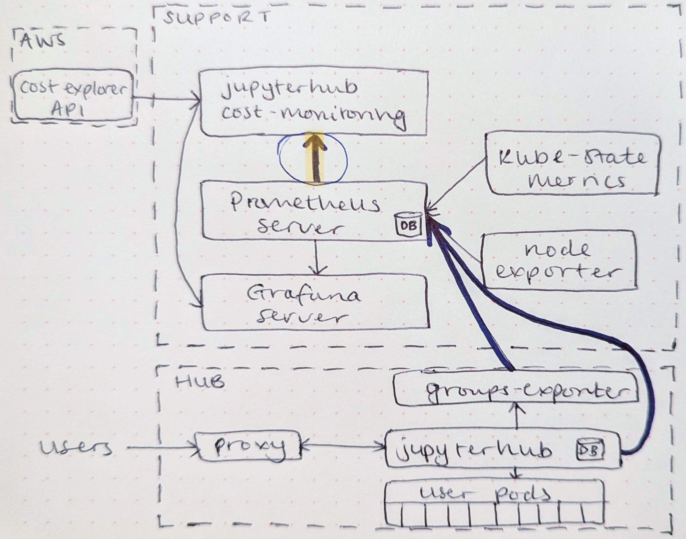

# Architecture

This document outlines the architecture of the project, including its dependencies, their interactions, and the overall design principles.

## Overview

:::{note}
The diagram above is a temporary placeholder. The highlighted arrow indicates the key usage metrics pulled from the Prometheus server for the [per-user cost weightings](https://hackmd.io/@jnywong/HJB8ewSree#Compute-component).
:::

Cost data is exposed with `jupyterhub-cost-monitoring` via a Flask web application that serves as an endpoint for other applications in the cluster. The following endpoints are available:

- `/index`: Returns all available endpoints.
- `/ready`: Returns a 200 OK response if the application is ready to serve requests.
- `hub_names`: Returns a list of all JupyterHub names in the cluster.
- `total_costs`: Returns daily total costs and divided into two types:
  - *Account*: The total costs as reported by the cloud provider.
  - *Attributable*: The total costs that can be attributed by the `jupyterhub-cost-monitoring` application. For example, the act of querying the totals costs reported by cloud provider incurs a cost and is not included in *attributable* costs but is included in *account* costs.
- `total_costs_per_hub`: Returns the daily total costs per hub listed in `hub_names`.
- `total_costs_per_component`: Returns the daily total costs per cloud component.
