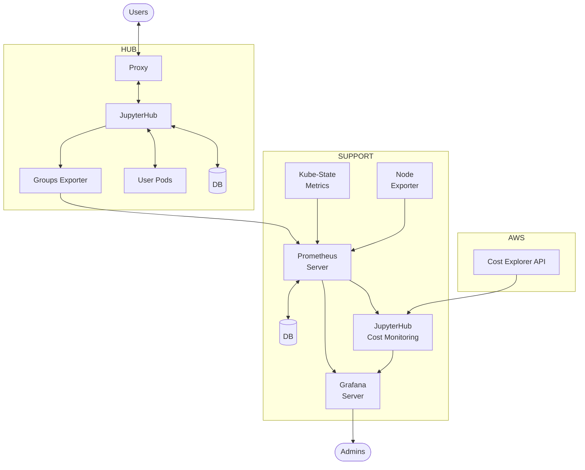

# Architecture

This document outlines the architecture of the project, including its dependencies, their interactions, and the overall design principles.

## Overview

This architecture diagram outlines how the cost monitoring infrastructure sits in the wider [Zero to JupyterHub](https://z2jh.jupyter.org/) deployment, which is divided into two main namespaces: Support and Hub, as well as the external AWS service.

The Support section is where the JupyterHub Cost Monitoring backend is deployed. This backend retrieves cost data from the [AWS Cost Explorer API](https://docs.aws.amazon.com/cost-management/latest/userguide/ce-api.html). Usage data is collected by a [Prometheus](https://prometheus.io/) server from various exporters, including [kube-state-metrics](https://github.com/kubernetes/kube-state-metrics), [node_exporter](https://github.com/prometheus/node_exporter), and a [jupyterhub-groups-exporter](https://github.com/2i2c-org/jupyterhub-groups-exporter). Prometheus stores metrics in an internal time series database which can be queried with PromQL and exposes to [Grafana](https://grafana.com/) for visualization.

The Hub section represents the user-facing [JupyterHub](https://jupyterhub.readthedocs.io/en/stable/) components where users can connect via a proxy to the JupyterHub instance. JupyterHub manages User Pods and stores state, such as users, groups, server sessions, in a dedicated database. The [jupyterhub-groups-exporter](https://github.com/2i2c-org/jupyterhub-groups-exporter) extracts group-related information from JupyterHub and sends it to Prometheus.

## Cost Monitoring

Cost data is exposed with `jupyterhub-cost-monitoring` via a Flask web application that serves as an endpoint for other applications in the cluster. The following endpoints are available:

- `/index`: Returns all available endpoints.
- `/ready`: Returns a 200 OK response if the application is ready to serve requests.
- `/hub_names`: Returns a list of all JupyterHub names in the cluster.
- `/total_costs`: Returns daily total costs and divided into two types:
  - *Account*: The total costs as reported by the cloud provider.
  - *Attributable*: The total costs that can be attributed by the `jupyterhub-cost-monitoring` application. For example, the act of querying the totals costs reported by cloud provider incurs a cost and is not included in *attributable* costs but is included in *account* costs.
- `/total_costs_per_hub`: Returns the daily total costs per hub listed in `hub_names`.
- `/total_costs_per_component`: Returns the daily total costs per cloud component.
